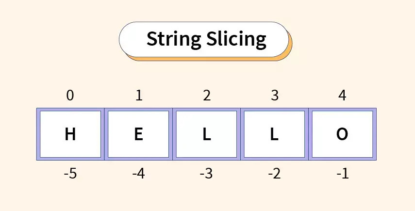
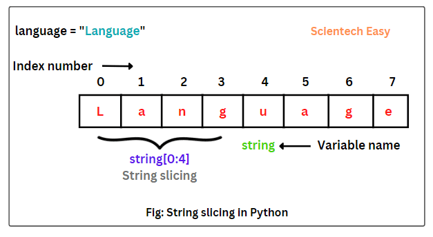
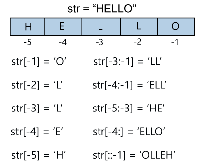
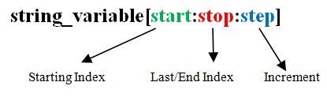

**<div align="center" >Strings in Python</div>**

### Table of content
- [Introduction to Strings](#introduction-to-strings)
  - [Creating Strings](#creating-strings)
  - [Accessing Characters in a String](#accessing-characters-in-a-string)
- [String Slicing in Python](#string-slicing-in-python)
  - [Basic String Slicing](#basic-string-slicing)
    - [Example: Basic Slicing](#example-basic-slicing)
  - [Negative Indices in Slicing](#negative-indices-in-slicing)
    - [Example: Negative Indices](#example-negative-indices)
  - [Step in Slicing](#step-in-slicing)
    - [Example: Step in Slicing](#example-step-in-slicing)
  - [Reverse String Using Slicing](#reverse-string-using-slicing)
    - [Example: Reverse String](#example-reverse-string)
- [Rules Of Slicing](#rules-of-slicing)
- [Immutability of Strings in Python](#immutability-of-strings-in-python)
  - [What is Immutability?](#what-is-immutability)
  - [Demonstrating Immutability](#demonstrating-immutability)
    - [Example 1: Attempting to Modify a String](#example-1-attempting-to-modify-a-string)
    - [Example 2: Creating a New String by Concatenation](#example-2-creating-a-new-string-by-concatenation)
  - [Conclusion](#conclusion)

# Introduction to Strings

In Python, a string is a sequence of characters enclosed within single quotes (' '), double quotes (" "), or triple quotes (''' ''' or """ """).<br>
- Strings are a fundamental data type used to represent textual data. 
- They allow you to store, manipulate, and process textual information in your Python programs.

## Creating Strings

To create a string in Python, you can use single quotes, double quotes, or triple quotes. All three forms are equivalent, and you can choose the one that suits your needs.

```python
# Using single quotes
single_quoted_str = 'Hello, Python!'

# Using double quotes
double_quoted_str = "Hello, Python!"

# Using triple quotes (multi-line string)
multi_line_str = '''Hello,
Python!'''

# You can also use triple double quotes
multi_line_str_double = """Hello,
Python!"""
```

## Accessing Characters in a String

You can access individual characters in a string using indexing. In Python, indexing starts from 0, meaning the first character is at index 0, the second character at index 1, and so on.

```python
str1 = "Hello, Python!"
print(str1[0])  # Output: 'H'
print(str1[7])  # Output: 'P'
```

# String Slicing in Python

String slicing in Python allows you to extract a substring from a given string based on specified start and end indices.



> Slicing enables you to work with substrings, making it easier to manipulate and process parts of a string as needed.

## Basic String Slicing

The basic syntax for string slicing is as follows:

```python
string[start:end]
```

Here, `start` is the index of the first character you want to include in the substring, and `end` is the index of the character up to which you want to extract the substring. Note that the character at index `end` will not be included in the substring.




### Example: Basic Slicing

```python
# Define the original string
original_str = "Hello, Python!"

# Slice from index 0 to 5 (excluding character at index 5)
substring1 = original_str[0:5]
print(substring1)  # Output: "Hello"

# Slice from index 7 to the end of the string
substring2 = original_str[7:]
print(substring2)  # Output: "Python!"
```

## Negative Indices in Slicing

In Python, you can also use negative indices in slicing. A negative index starts counting from the end of the string, with `-1` representing the last character, `-2` representing the second-to-last character, and so on.

<p align="center">
    
</p>

### Example: Negative Indices

```python
# Define the original string
original_str = "Hello, Python!"

# Slice from the last character to the second-to-last character
substring1 = original_str[-1:-2]
print(substring1)  # Output: ""

# Slice from the second-to-last character to the last character
substring2 = original_str[-2:-1]
print(substring2)  # Output: "n"
```

## Step in Slicing

You can also specify a step value in the slicing syntax to skip characters in the substring. The syntax for step is as follows:

```python
string[start:end:step]
```

Here, `step` represents the number of characters to skip between each character in the substring.

<p align="center">
    
</p>

### Example: Step in Slicing

```python
# Define the original string
original_str = "Hello, Python!"

# Slice with a step of 2 (every second character)
substring1 = original_str[::2]
print(substring1)  # Output: "HloPto!"

# Slice with a step of 3 (every third character)
substring2 = original_str[1::3]
print(substring2)  # Output: "eoo"
```

## Reverse String Using Slicing

Slicing can be used to reverse a string by specifying a negative step value.

### Example: Reverse String

```python
# Define the original string
original_str = "Hello, Python!"

# Reverse the string using slicing with a step of -1
reversed_str = original_str[::-1]
print(reversed_str)  # Output: "!nohtyP ,olleH"
```

> - String slicing in Python is a powerful technique that allows you to work with substrings efficiently.
> - By specifying the start, end, and step values in the slicing syntax, you can extract specific parts of a string, skip characters, and even reverse the string.
> - Understanding string slicing will enable you to manipulate text data effectively in your Python programs.

# Rules Of Slicing

1. If you want to give a `start` value of `0` in slicing, it is not necessary to give because the **default value for `start` is `0`**:
   ```python
   # Both are the same.
   s = "abcdefghijk"
   print(s[:10])  # Output: "abcdefghij"
   print(s[0:10])  # Output: "abcdefghij"
   ```

2. If you want to give an `end` value as the length of the string in slicing, there is no need to give it explicitly because the **default value for `end` is the length of the string**:
   ```python
   # Both are the same.
   s = "abcdefghijk"
   print(s[3:])  # Output: "defghijk"
   print(s[3:11])  # Output: "defghijk"
   ```

3. If you want to give a **`start` value** of **`0`** and an **`end` value** of **the length of the string**, then there is no need to give them explicitly because the **default value for `start` is `0`** and **the default value for `end` is the length of the string**:
   ```python
   # Both are the same.
   s = "abcdefghijk"
   print(s[0:11])  # Output: "abcdefghijk"
   print(s[:])  # Output: "abcdefghijk"
   ```

4. If you want to give a `step` value of `1` in slicing, there is no need to give it explicitly because the **default value for `step` is `1`**:
   ```python
   # Both are the same.
   s = "abcdefghijk"
   print(s[:3:1])  # Output: "abc"
   print(s[:3])  # Output: "abc"
   ```

5. Don't use positive and negative values as start and end values in a string slicing query.

6. If the step value is positive, then don't give start and end values like this:
   ```python
   # Both are the same.
   s = "abcdefghijk"
   print(s[10:4])  # Output: ""
   ```
   - Always the start should be greater than the end **`(start > end)`**.

# Immutability of Strings in Python

In Python, strings are immutable, which means that once a string is created, its contents cannot be changed.
- Immutability ensures that the value of a string remains the same throughout its lifetime.
- This property has important implications in how strings are stored, accessed, and manipulated in Python.

## What is Immutability?

In programming, an object is considered immutable if its state (i.e., the values of its attributes) cannot be modified after it is created.<br>

In the case of strings, immutability means that you cannot change the characters in an existing string directly.

## Demonstrating Immutability

Let's explore some examples to demonstrate the immutability of strings.

### Example 1: Attempting to Modify a String

```python
string1 = "Hello, Python!"

# Trying to change the character at index 4 to 'X' (which is 'o' in the original string)
string1[4] = 'X'  # This will raise a TypeError
```

Output:
```
TypeError: 'str' object does not support item assignment
```

As you can see, attempting to modify a character in the string `string1` directly using indexing results in a `TypeError`. This error message indicates that strings do not support item assignment because they are immutable.

### Example 2: Creating a New String by Concatenation

Although strings are immutable, you can create new strings by concatenating or combining existing strings.

```python
string2 = "Hello, "
string3 = "Python!"
new_string = string2 + string3
print(new_string)  # Output: "Hello, Python!"
```

In this example, a new string `new_string` is created by concatenating `string2` and `string3`. The original strings `string2` and `string3` remain unchanged.

## Conclusion

- In Python, strings are immutable, which means their values cannot be changed after creation. 
- While you cannot modify individual characters in a string directly, you can create new strings by concatenating or combining existing ones. 
- Understanding the immutability of strings helps you write robust and efficient Python programs that work seamlessly with text data.